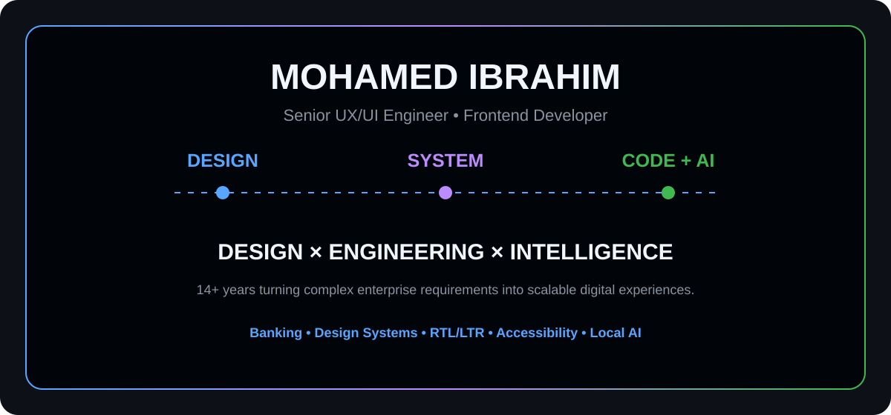
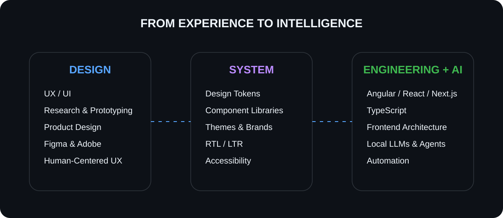
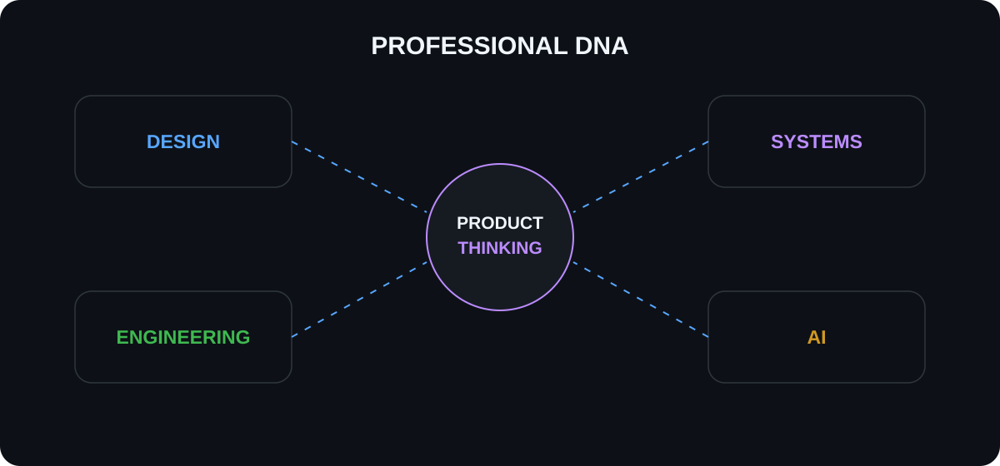
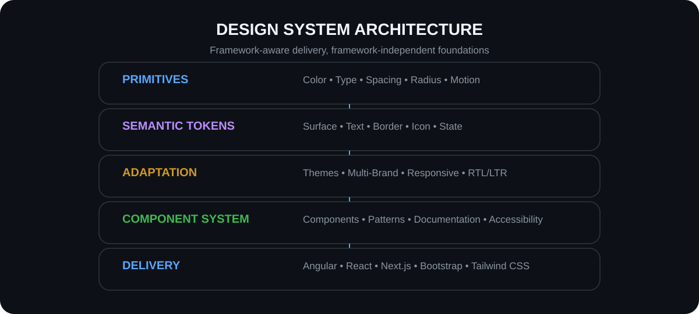
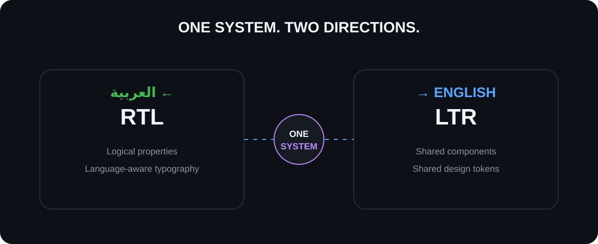
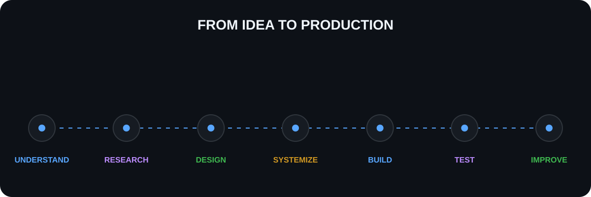
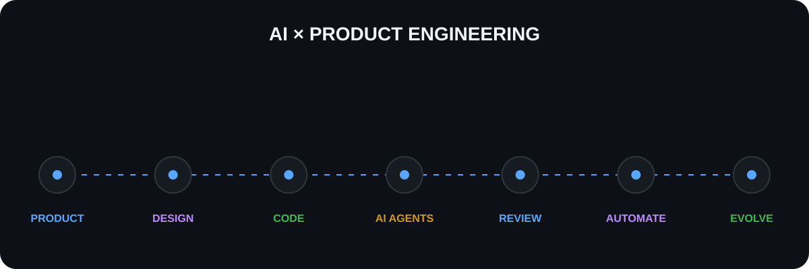
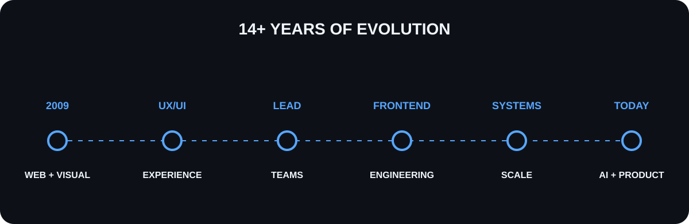
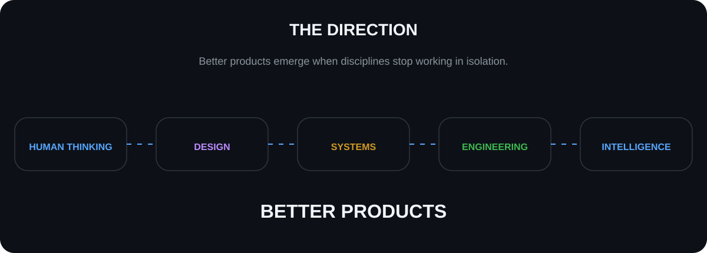

<!--
  Mohamed Ibrahim Abdel Razik
  GitHub Profile
  © 2026 Mohamed Ibrahim Abdel Razik. All Rights Reserved.
-->

<div align="center">



<br/>

[](https://www.linkedin.com/in/mohamedibrahimdesigner/)
[](https://www.behance.net/mibrahim-designer)


</div>

<br/>

## Beyond the Interface

I have spent more than **14 years** working where design decisions become real products.

My career started with visual and web design, evolved through UX/UI and product design, and expanded into frontend engineering, enterprise platforms, and scalable Design Systems.

Today, my work sits at the intersection of:

**Product Design · Design Systems · Frontend Engineering · Enterprise UX · Artificial Intelligence**

I don't treat these as separate disciplines.

I use them together to transform complex requirements into experiences that are clear for users, scalable for teams, maintainable for engineers, and ready to evolve.

<br/>

<div align="center">

### DESIGN → SYSTEM → CODE → INTELLIGENCE

</div>

<br/>



<br/>

## Professional DNA

Instead of choosing between **designer** and **engineer**, my career has developed across both.



### 🎨 Product & Experience Design

`UX/UI Design` `Product Design` `Interaction Design` `User-Centered Design`

`UX Research` `Wireframing` `Prototyping` `Visual Design`

`Responsive Web Design` `Mobile UI Design` `Customer Experience`

`Storyboarding` `Information Architecture` `Content Strategy` `Product Roadmapping`

<br/>

### 🧩 Design Systems

`Design Tokens` `Semantic Tokens` `Component Libraries`

`Storybook` `Style Dictionary` `CSS Variables`

`Multi-Theme Architecture` `Multi-Brand Systems`

`Component Documentation` `Responsive Foundations`

`Accessibility` `RTL/LTR Parity`

<br/>

### 💻 Frontend Engineering

`Angular` `React` `Next.js` `TypeScript` `JavaScript`

`HTML5` `CSS3` `SCSS` `Tailwind CSS` `Bootstrap`

`RxJS` `jQuery` `Node.js`

`Component Architecture` `State Management` `API Integration`

`Responsive Architecture` `Performance Optimization`

<br/>

### 🤖 AI & Intelligent Engineering

`Local LLMs` `AI Agents` `Generative AI`

`AI-Powered UX` `AI-Assisted Development`

`Model Orchestration` `Research Workflows`

`Coding Agents` `Automation` `Local-First AI`

---

# Design Systems Engineering

A Design System is not a collection of buttons.

For me, it is the **shared architecture between design and engineering**.

It needs to scale across products, brands, themes, languages, devices, and implementation technologies without losing consistency.

<br/>



<br/>

### Architecture I work with

**Foundation**

`Primitives` → `Semantic Tokens` → `Component Tokens`

**Experience**

`Typography` · `Color` · `Spacing` · `Elevation` · `Motion` · `Iconography`

**Adaptation**

`Responsive` · `Themes` · `Multi-Brand` · `Arabic/English` · `RTL/LTR`

**Implementation**

`Components` · `Patterns` · `Documentation` · `Testing`

**Delivery**

`Angular` · `React` · `Next.js` · `Bootstrap` · `Tailwind CSS`

The goal is not to bind the Design System to one framework.

The goal is to create a **shared design language and token architecture** that can serve multiple implementation technologies.

---

# Design Toolkit

<div align="center">


<br/><br/>


</div>

### Design capabilities

**Experience Design**

UX/UI · Interaction Design · User-Centered Design · UX Research · Customer Experience

**Product**

Product Design · Product Roadmapping · Information Architecture · Content Strategy

**Exploration**

Wireframes · User Flows · Storyboards · Mockups · Interactive Prototypes

**Visual**

Visual Design · Typography · Layout · Iconography · Responsive Design · Mobile UI

**Systems**

Design Systems · Tokens · Components · Themes · Accessibility · RTL/LTR

---

# Engineering Stack

<div align="center">


</div>

<br/>

### Frontend

`Angular` · `React` · `Next.js`

`TypeScript` · `JavaScript`

`HTML5` · `CSS3` · `SCSS`

`Tailwind CSS` · `Bootstrap`

`RxJS` · `jQuery` · `Node.js`

### Architecture

`Reusable Components`

`Component-Driven Architecture`

`State Management`

`API Integration`

`Responsive Architecture`

`Performance Optimization`

`Cross-Browser Compatibility`

`Design System Integration`

---

# Enterprise Product Engineering

I have worked on digital products where UI quality is only one part of the problem.

Enterprise products also require:

```text
CONSISTENCY
     +
SCALABILITY
     +
ACCESSIBILITY
     +
SECURITY-AWARE UX
     +
MULTILINGUAL SUPPORT
     +
MAINTAINABILITY
```

My work includes experience across:

`Banking`

`E-Government`

`Enterprise Platforms`

`Telecommunications`

`Web Applications`

`Mobile Applications`

<br/>

### Enterprise Platforms


`Sitecore` · `Sitecore JSS` · `SharePoint` · `Nx Monorepos`

---

# Arabic + English by Design

RTL support is not something I add at the end of a project.

It needs to exist in the architecture from the beginning.



### My approach

`Arabic ↔ English`

`RTL ↔ LTR`

`Logical Properties`

`Language-Aware Typography`

`Responsive Tokens`

`Shared Components`

`WCAG Accessibility`

`Consistent User Experience`

The objective is a single component architecture that behaves naturally regardless of language direction.

---

# Selected Enterprise Work

## 🏦 Al Rajhi Bank

### Public Website

**Design & Frontend Implementation**

Building and evolving production banking interfaces with emphasis on:

`Bilingual Arabic/English UX`

`Responsive Architecture`

`Accessibility`

`Design System Consistency`

`Reusable Components`

`Enterprise Frontend Quality`

**Technology**

`Angular` · `TypeScript` · `SCSS` · `Sitecore JSS` · `RTL/LTR`

<br/>

### Business Banking

**Enterprise Product Design & Frontend Implementation**

Working on complex business banking experiences with focus on secure user journeys, reusable UI architecture, consistency across products, and maintainable frontend implementation.

**Technology**

`Angular` · `TypeScript` · `SCSS` · `Design Systems` · `Component Libraries` · `RTL/LTR`

---

# From Design to Production



```text
Understand
   ↓
Research
   ↓
Design
   ↓
Prototype
   ↓
Systemize
   ↓
Build
   ↓
Test
   ↓
Measure
   ↓
Improve
```

The important part is not any individual step.

It is keeping the **intent of the experience intact** while moving from idea to production.

---

# AI × Product Engineering

AI is becoming another layer in my product engineering workflow.

I am interested in what happens when AI moves beyond the chat window and becomes part of the actual system.



### 🧠 Local LLMs

Exploring private and local-first intelligence where models can run close to development environments and internal workflows.

### 🤖 AI Agents

Building and experimenting with agents capable of research, coding, testing, review, documentation, and multi-step engineering tasks.

### 🎨 AI-Powered UX

Using AI as an augmentation layer for research, ideation, analysis, prototyping, and product exploration.

### 💻 AI-Assisted Engineering

Integrating AI into coding, debugging, testing, documentation, architecture review, and engineering workflows.

### 🔀 Model Orchestration

Exploring workflows where different models handle different responsibilities instead of expecting one model to solve every problem.

### 🔐 Local-First Thinking

Exploring how local models can support privacy-sensitive workflows while cloud intelligence remains available when it provides meaningful additional capability.

---

# Engineering Toolbox

<div align="center">


<br/><br/>


</div>

`Git` · `GitHub` · `Docker`

`npm` · `pnpm` · `Nx`

`VS Code` · `Postman`

`Jira` · `Confluence`

---

# Testing & Quality

<div align="center">


</div>

<br/>

**Quality is part of the architecture.**

`Component Testing`

`Unit Testing`

`E2E Testing`

`Accessibility Testing`

`Responsive Testing`

`Cross-Browser Testing`

`Performance`

---

# Career Evolution



<div align="center">

### 2009 → TODAY

**Visual & Web Design**

↓

**UX/UI Design**

↓

**Product & Interaction Design**

↓

**Team Leadership**

↓

**Frontend Engineering**

↓

**Enterprise Design Systems**

↓

**AI-Enhanced Product Engineering**

</div>

<br/>

That journey changed how I think about digital products.

I understand the pixels.

I understand the components behind them.

I understand the system connecting those components.

And I'm exploring the intelligence that can improve the system around them.

---

# Continuous Learning

<div align="center">

## 14+ YEARS OF EXPERIENCE

### STILL LEARNING. STILL BUILDING. STILL EVOLVING.

</div>

### Anthropic

**Claude 101**

### IBM

**Generative AI: Elevate your Software Development Career**

### Interaction Design Foundation

`AI-Powered UX Design`

`Human-Computer Interaction`

`UX Management: Strategy and Tactics`

`Service Design`

`Visual Design`

`Mobile UI Design`

`AR/VR Design`

`Design Systems with Storytelling`

### LinkedIn Learning

`UX Foundations`

`Style Guides & Design Systems`

`Prototyping`

`UX Research`

`Customer Experience`

---

# GitHub Activity

<div align="center">


<br/><br/>


</div>

> GitHub repository language statistics represent repository composition, not the breadth of my professional engineering experience.

---

# The Direction



<div align="center">

I believe the next generation of digital products will not be created by

**Design alone.**

or

**Engineering alone.**

or

**AI alone.**

<br/>

It will come from understanding how they work together.

<br/>

## HUMAN THINKING

↓

## DESIGN

↓

## SYSTEMS

↓

## ENGINEERING

↓

## INTELLIGENCE

↓

# BETTER PRODUCTS

</div>

---

# Let's Connect

<div align="center">

Interested in conversations around

**Product Design · Design Systems · Frontend Architecture**

**Enterprise UX · Local AI · AI Agents · Intelligent Developer Tooling**

<br/>

[](https://www.linkedin.com/in/mohamedibrahimdesigner/)

[](https://www.behance.net/mibrahim-designer)

<br/><br/>

### DESIGN · BUILD · SYSTEMIZE · EVOLVE

</div>

---

<div align="center">

<sub>

© 2026 Mohamed Ibrahim Abdel Razik. All Rights Reserved.

The original written content, visual identity, custom illustrations, diagrams, presentation structure, and visual assets contained in this profile are protected works.

No permission is granted to copy, reproduce, republish, redistribute, modify, or create derivative versions of the original profile content or custom visual assets without prior written permission from the copyright owner.

**Public access to this repository does not constitute a license to reuse its original content.**

</sub>

</div>
